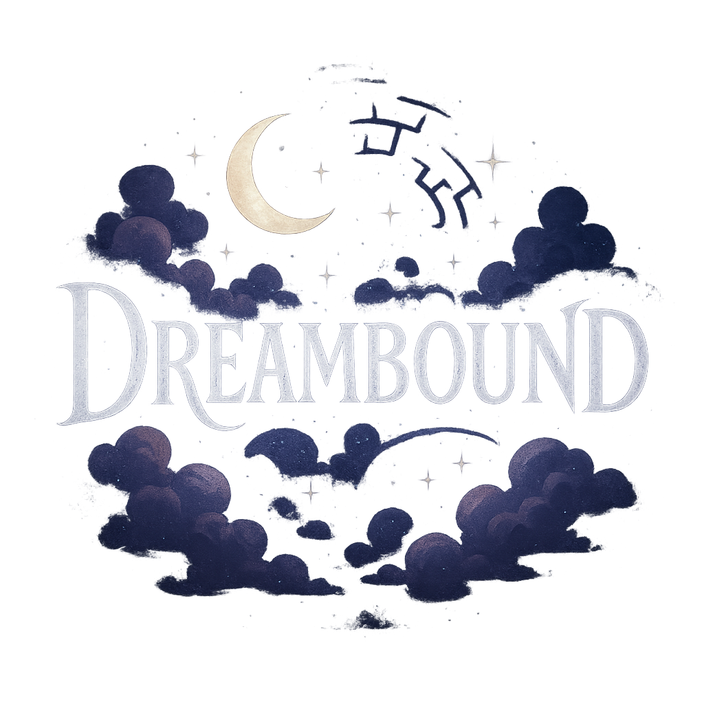

<!-- LOGO PLACEHOLDER -->

  

# 🌌 Dreambound

## 👥 1. Présentation de l'équipe

Nous sommes **Amine Haddab** et **Gana Abdelkader**, étudiants à l’Université Haute-Alsace à Mulhouse.  
- Amine est en **Master 2 MIAGE**  
- Gana est en **Licence 3 MIAGE**

Nous avons collaboré sur toutes les parties du projet, partageant la création de la logique et du visuel pour une expérience fluide et immersive.

---

## 🎮 2. Nom du jeu

**Dreambound**  
*« Liés par le rêve, éveillés par le défi »*

---

## 📖 3. Description du jeu

**Dreambound** vous plonge dans un univers onirique où vous êtes coincé dans un rêve.  
Pour vous réveiller, trouvez trois éléments clés et échappez à ce cauchemar éternel.

### 🌟 Les niveaux :

1. **Le labyrinthe obscur**  
   Trouvez la lumière au bout du chemin pour avancer.

2. **Les passerelles**  
   Sautez à gauche ou à droite sur les bonnes passerelles. Chaque erreur vous ramène au début.

3. **Le réveil géant**  
   Évitez les projectiles en forme de petits nuages en sautant à gauche ou à droite.  
   Un contact vous fait recommencer.

Un narrateur guide le joueur tout au long de l’aventure.

---

## 🎮 4. Mécaniques & Contrôles

- 🔄 **Déplacements** : Z Q S D ou flèches directionnelles  
- ⬆️ **Saut** : Espace  
- 🎥 **Caméra** : Vue à la première personne, suivant les mouvements du joueur  
- 🎯 **Condition de jeu** : Pas de game over, le jeu continue jusqu’à la réussite finale  

---

## 🕹️ 5. Comment jouer

- Lancez le jeu (voir [Guide d'utilisation du jeu](./GuideUtilisation.md)  ).  
- Utilisez les touches pour avancer et interagir.  
- Résolvez chaque mini-jeu guidé par le narrateur.  
- Évitez les obstacles et mémorisez les chemins.  
- Atteignez la fin du troisième niveau pour vous « réveiller ».

---

## 📸 6. Démo

*Section à compléter prochainement.*  

Les vidéos de gameplay et présentation sont disponibles via un Google Drive.
- [Lien du repéretoire sur Google Drive](https://drive.google.com/drive/folders/1Tf7yyOTqn-4mb3lfqxvpOOb0SYGV5oLb?usp=drive_link) 
- [Vidéo de présentation](https://drive.google.com/file/d/1U4aApzYtJOjwDhCfP3jEIjo05QwI_isO/view?usp=drive_link) 
- [Vidéo de Gameplay]()  

---

## 🛠️ 7. Technologies utilisées

- 🕹️ **Babylon.js** (moteur 3D)  
- 🎨 **Blender** (modélisation & animation)  
- 🌐 **Textures** : [PolyHaven](https://polyhaven.com/)  
- 📦 **Modèles 3D** : [Sketchfab](https://skfb.ly/) 
- 🛠️ **Animations** : [Mixamo](https://www.mixamo.com/#/) 
- 🎙️ **Voix narrateur** : Clipchamp & Adobe Premiere Pro  

---

## 🌐 8. Documentation

- [Guide d'utilisation du jeu](./GuideUtilisation.md)
- [Documentation](./Documentation.md)  

---

## 🔮 9. État du projet & perspectives

**Dreambound** est fonctionnel et jouable avec ses trois niveaux et son histoire immersive.

Il reste cependant des axes d’amélioration :  

- 🔊 Ajouter plus d’effets sonores pour renforcer l’ambiance.  
- 🎞️ Affiner les animations des objets et projectiles.  
- 🖥️ Intégrer une interface utilisateur plus complète (menus, tutoriels, feedback).

---

## 📇 10. Contact & Réseaux

Pour suivre notre travail ou nous contacter :  

- [Amine Haddab sur LinkedIn](https://www.linkedin.com/in/aminehaddab)  
- [Gana Abdelkader sur LinkedIn](https://www.linkedin.com/in/gana-abdelkader)

---

Merci pour votre intérêt et votre soutien !  

**Amine Haddab & Gana Abdelkader**  
Université Haute-Alsace, Mulhouse — Mai 2025